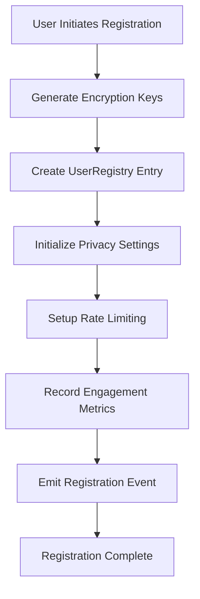
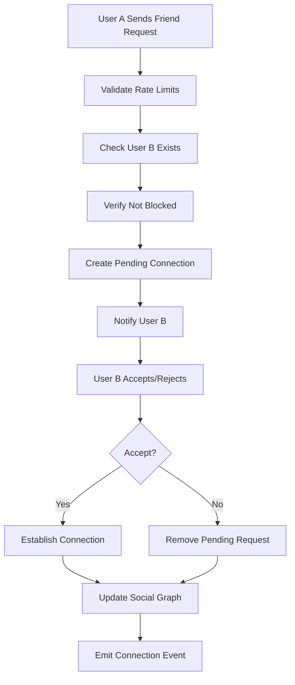
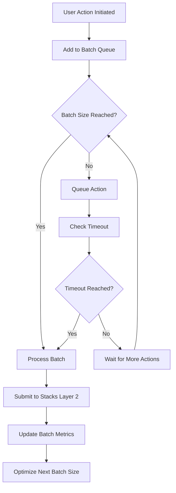

# OrangeNetwork

## Bitcoin-Native Social Protocol for the Decentralized Web

[](https://stacks.co)
[](https://bitcoin.org)
[](https://clarity-lang.org)

## Overview

OrangeNetwork is a cutting-edge decentralized social networking protocol built on Bitcoin's security foundation via Stacks Layer 2. It empowers users with complete data sovereignty while maintaining enterprise-grade privacy and scalability through intelligent batch processing and zero-knowledge privacy controls.

### Key Features

- **🔐 Zero-Knowledge Privacy** - Client-side encryption with optional key rotation
- **⚡ Adaptive Batch Processing** - AI-optimized Layer 2 transaction efficiency
- **🪙 Bitcoin-Anchored Identity** - Self-sovereign identity tied to Bitcoin addresses
- **🛡️ Intelligent Spam Prevention** - Multi-layered abuse protection systems
- **🎛️ Granular Permission Model** - Fine-grained control over social interactions
- **📊 Immutable Social Graph** - Permanent relationship records on Bitcoin

## System Overview

OrangeNetwork operates as a three-tier architecture designed for optimal performance and security:

```
┌─────────────────────────────────────────────────────────────┐
│                    APPLICATION LAYER                        │
│  ┌─────────────────┐  ┌─────────────────┐  ┌─────────────────┐ │
│  │   Web Client    │  │  Mobile App     │  │   API Gateway   │ │
│  └─────────────────┘  └─────────────────┘  └─────────────────┘ │
└─────────────────────────────────────────────────────────────┘
                                │
                                ▼
┌─────────────────────────────────────────────────────────────┐
│                    PROTOCOL LAYER                           │
│  ┌─────────────────┐  ┌─────────────────┐  ┌─────────────────┐ │
│  │ Privacy Engine  │  │ Batch Processor │  │ Rate Limiter    │ │
│  └─────────────────┘  └─────────────────┘  └─────────────────┘ │
│  ┌─────────────────┐  ┌─────────────────┐  ┌─────────────────┐ │
│  │ Social Graph    │  │ User Registry   │  │ Access Control  │ │
│  └─────────────────┘  └─────────────────┘  └─────────────────┘ │
└─────────────────────────────────────────────────────────────┘
                                │
                                ▼
┌─────────────────────────────────────────────────────────────┐
│                 BLOCKCHAIN LAYER                            │
│  ┌─────────────────┐  ┌─────────────────┐  ┌─────────────────┐ │
│  │  Stacks Layer 2 │  │ Bitcoin Network │  │ Clarity VM      │ │
│  │  (Smart Contracts)│  │ (Settlement)   │  │ (Execution)     │ │
│  └─────────────────┘  └─────────────────┘  └─────────────────┘ │
└─────────────────────────────────────────────────────────────┘
```

## Contract Architecture

The OrangeNetwork smart contract is organized into six core modules:

### 1. **Identity Management Module**

- **UserRegistry**: Primary user profile storage with encryption support
- **PrivacyConfiguration**: Granular privacy controls per user
- **UserEngagementMetrics**: Activity tracking and analytics

### 2. **Social Graph Module**

- **SocialConnections**: Bidirectional relationship management
- **AccessControlList**: User blocking and restriction system
- **Relationship validation and status tracking**

### 3. **Performance Optimization Module**

- **BatchProcessingData**: Layer 2 transaction optimization
- **ActionRateLimits**: Multi-tier rate limiting system
- **Dynamic batch size adjustment algorithms**

### 4. **Security & Privacy Module**

- **End-to-end encryption key management**
- **Zero-knowledge metadata protection**
- **Multi-signature transaction validation**

### 5. **Anti-Abuse Module**

- **Intelligent rate limiting with reset cycles**
- **Reputation-based spam prevention**
- **Behavioral analysis and anomaly detection**

### 6. **Utility & Helper Module**

- **Mathematical optimization functions**
- **Validation and verification utilities**
- **Error handling and logging systems**

## Data Flow

### User Registration & Profile Management



### Social Connection Establishment



### Batch Processing Optimization



## Technical Specifications

### Smart Contract Details

| Parameter | Value |
|-----------|-------|
| **Language** | Clarity |
| **Network** | Stacks Layer 2 |
| **Settlement** | Bitcoin Network |
| **Consensus** | Proof of Transfer (PoX) |
| **Gas Optimization** | Batch Processing |
| **Security Model** | Multi-signature validation |

### Rate Limiting Configuration

| Action Type | Daily Limit | Reset Period |
|-------------|-------------|--------------|
| **Total Actions** | 100 | 24 hours |
| **Friend Requests** | 20 | 24 hours |
| **Profile Updates** | 24 | 24 hours |
| **Batch Processing** | 10-100 per batch | 1 hour timeout |

### Privacy & Security Features

- **Client-Side Encryption**: AES-256 with optional key rotation
- **Metadata Protection**: Zero-knowledge proof integration
- **Access Control**: Granular permissions per interaction type
- **Audit Trail**: Immutable activity logs on Bitcoin
- **Recovery Mechanisms**: Time-locked account recovery

## Getting Started

### Prerequisites

- Node.js (v16 or higher)
- Stacks CLI
- Bitcoin testnet/mainnet access
- Clarity development environment

### Installation

```bash
# Clone the repository
git clone https://github.com/your-org/orange-network.git
cd orange-network

# Install dependencies
npm install

# Setup environment
cp .env.example .env

# Configure your Stacks network settings
# Edit .env with your configuration
```

### Deployment

```bash
# Deploy to testnet
npm run deploy:testnet

# Deploy to mainnet
npm run deploy:mainnet

# Verify deployment
npm run verify
```

### Testing

```bash
# Run unit tests
npm test

# Run integration tests
npm run test:integration

# Run security audits
npm run audit
```

## API Reference

### Core Functions

#### User Management

```clarity
;; Register new user
(define-public (register-user (display-name (string-ascii 64))))

;; Update user profile
(define-public (update-comprehensive-user-profile 
  (display-name (optional (string-ascii 64)))
  (encrypted-metadata (optional (string-utf8 256)))
  (client-encryption-key (optional (buff 32)))
  (avatar-uri (optional (string-utf8 256)))))
```

#### Privacy Controls

```clarity
;; Configure privacy settings
(define-public (configure-advanced-privacy-settings
  (enable-social-graph-visibility bool)
  (enable-activity-status-sharing bool)
  (enable-profile-metadata-exposure bool)
  (enable-last-seen-broadcasting bool)
  (enable-avatar-display bool)
  (enable-end-to-end-encryption bool)))
```

#### Batch Processing

```clarity
;; Optimize batch processing
(define-public (optimize-batch-processing-parameters (user principal)))

;; Configure batch size
(define-public (configure-batch-processing-size (desired-batch-size uint)))
```

## Security Considerations

### Smart Contract Security

- **Multi-signature validation** for critical operations
- **Time-locked deactivation** with recovery periods
- **Input validation** for all user-provided data
- **Overflow protection** in mathematical operations

### Privacy Protection

- **Client-side encryption** before on-chain storage
- **Metadata obfuscation** to prevent analysis
- **Optional key rotation** for enhanced security
- **Zero-knowledge proofs** for sensitive operations

### Network Security

- **Bitcoin settlement** for ultimate finality
- **Stacks Layer 2** for scalable execution
- **Proof of Transfer** consensus mechanism
- **Byzantine fault tolerance** for social consensus

## Performance Optimizations

### Layer 2 Efficiency

- **Adaptive batch processing** reduces transaction costs
- **Dynamic batch sizing** based on network conditions
- **Intelligent queuing** minimizes confirmation times
- **Gas optimization** through efficient contract design

### Scalability Solutions

- **Horizontal scaling** through batch processing
- **Vertical optimization** via contract efficiency
- **Caching mechanisms** for frequently accessed data
- **Compression techniques** for metadata storage

## Contributing

We welcome contributions! Please see our [Contributing Guide](CONTRIBUTING.md) for details.

### Development Workflow

1. Fork the repository
2. Create a feature branch
3. Implement your changes
4. Add comprehensive tests
5. Submit a pull request

### Code Standards

- Follow Clarity best practices
- Maintain 100% test coverage
- Document all public functions
- Use semantic commit messages

## License

This project is licensed under the MIT License - see the [LICENSE](LICENSE) file for details.

## Acknowledgments

- Bitcoin Core developers for the foundational technology
- Stacks Foundation for Layer 2 innovation
- Clarity language contributors
- Open source community
